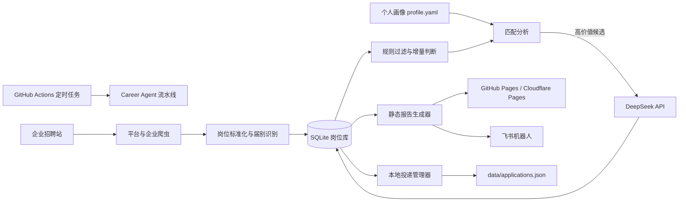
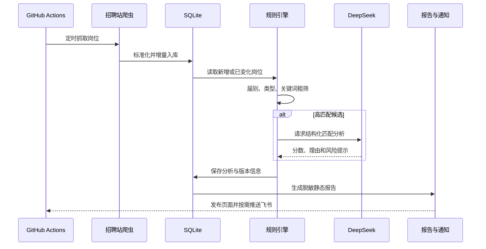

# Career Agent 架构说明

## 系统上下文

## 每日流水线

## 关键设计

- **增量优先**：岗位 JD、画像、模型和评分版本未变化时复用已有结果，减少运行时间与模型费用。
- **分层分析**：先用本地规则完成届别和岗位方向过滤，只对高价值候选调用更昂贵的模型。
- **失败隔离**：单个招聘站失败不会阻断整个抓取流程，也不会直接把历史岗位判定为下架。
- **发布解耦**：主流程产出静态报告，可发布到 GitHub Pages 或 Cloudflare Pages；本地管理器单独维护投递状态。
- **隐私边界**：API Key 和 Webhook 通过 Secrets 注入；公开部署前应清除个人投递记录和敏感分析。

## 主要数据

| 数据 | 作用 | 建议存储方式 |
| --- | --- | --- |
| `config.yaml` | 公司、入口与抓取策略 | Git 跟踪 |
| `profile.yaml` | 个人画像和评分规则 | 私有部署或脱敏示例 |
| `data/jobs.db` | 岗位、分析和增量状态 | 运行时存储或制品，不建议长期提交大文件 |
| `data/applications.json` | 投递进度 | 私有存储，不应公开 |
| `outputs/` | 静态报告 | `gh-pages` 或部署制品 |
